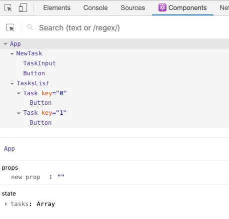

## React Concepts Summary

### 1. Components, Instances, and Elements

- Components are the building blocks of a React application. They encapsulate reusable UI logic and can be composed to create complex UIs.
- Instances are created from components and represent specific occurrences of a component in the component tree.
- Elements are plain JavaScript objects that describe what should be rendered on the screen. They represent components or HTML elements with associated properties (props).

### 2. Fiber Tree

- The [Fiber Tree](https://medium.com/@bendtherules/exploring-react-fiber-tree-20cbf62fe808)
  ()is an internal data structure used by React for efficient UI updates.
- It breaks down the work into smaller units called fibers, prioritizes the work, and allows interruption and resumption of tasks.
- The Fiber Tree helps React manage and organize the work needed to update a web application.

### 3. Virtual DOM

- The Virtual DOM is a concept in React that represents a virtual copy of the actual DOM (Document Object Model).
- It allows React to perform efficient updates by comparing the previous Virtual DOM with the new one to determine the minimal changes required.
- The Virtual DOM helps improve performance by minimizing actual DOM manipulations.

### 4. Rendering in React

- Rendering in React refers to the process of generating the UI based on component state and props.
- React follows a hierarchical component structure and performs reconciliation to identify the minimal set of changes required.
- The Virtual DOM is updated, and a diffing algorithm determines the specific changes to apply to the actual DOM for efficient updates.
- Lifecycle methods in components allow preparation and additional logic during the rendering process.

### 5. React Elements

- React elements are plain JavaScript objects that describe what should be rendered on the screen.
- They represent components or HTML elements and their associated properties (props).
- React elements are created using JSX syntax and are immutable.
- They form the foundation of React's virtual DOM and reconciliation process.

---

---

# React Section Key Learnings

## Components and Rendering

- Components are blueprints for UI elements.
- When a component is used, React creates an instance of it with props, state, and effects.
- Rendering means calling component functions to calculate what elements need to be added, deleted, or updated in the DOM.
- Initial app render and state updates trigger rendering for the entire application.
- Reconciliation compares previous and current renders to determine which elements need to be updated in the DOM.
- Diffing algorithm helps optimize updates by keeping unchanged elements and resetting changed elements.
- Keys in lists help React identify and optimize updates for specific elements.

## Best Practices

- Avoid declaring components inside other components to prevent unnecessary re-creation and state reset.
- Render logic (JSX) should have no side effects, such as API calls or state updates.
- Side effects should be placed in event handlers or useEffect.

## State and Events

- Multiple state updates within an event handler are batched and result in a single re-render, improving performance.
- State updates are asynchronous, and accessing a state variable immediately after an update may not reflect the latest value.
- Synthetic events are created by React and provide consistent behavior across different browsers.
- Most synthetic events bubble, except for scroll events.

## React as a Library

- React is a library, not a framework.
- It provides flexibility to integrate with third-party libraries and tools.
- A wide range of libraries can be used with React, requiring learning and selection based on project needs.
